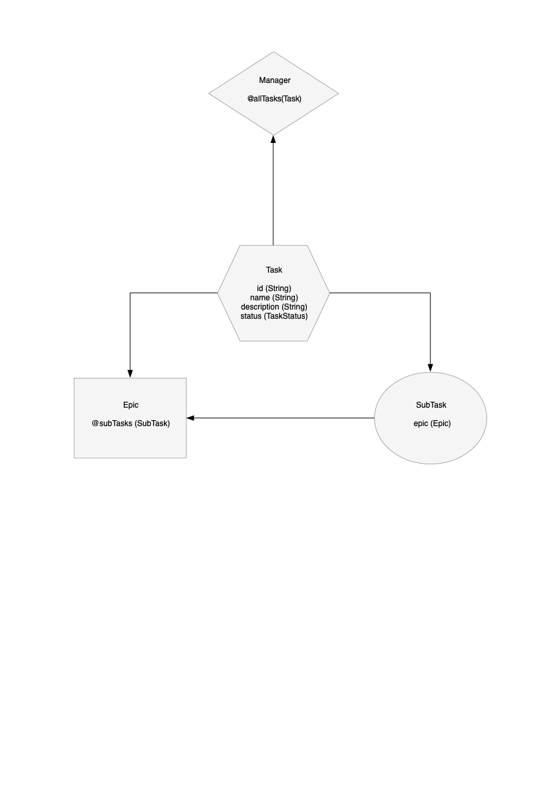

# java-sprint2-hw
Second sprint homework

# Логическая модель данных

# Curl JSON

curl -d
'{"name":"Сходить в кино", "description":"Посмотреть фильм Аватар", "status":"NEW", "status":"NEW"}' 
-H "Content-Type: application/json" -X http://localhost:8005/tasks/add